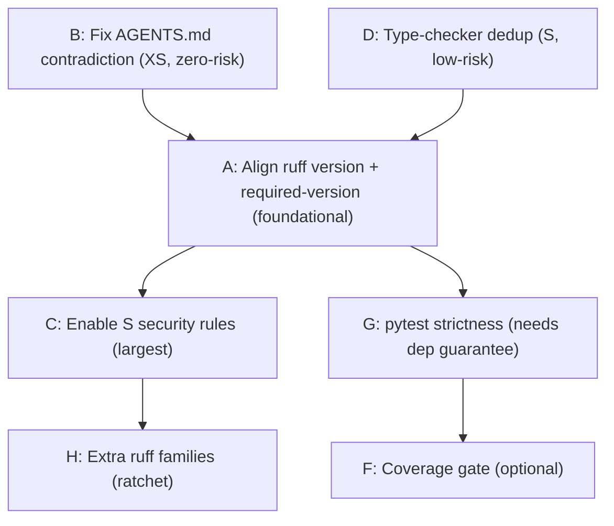

# GMP-Plan-135: pyproject.toml Phase 2 Hardening Plan

| Field | Value |
|-------|-------|
| **Plan ID** | GMP-Plan-135 |
| **Title** | pyproject.toml Phase 2 Hardening / Improvement |
| **Tier** | CI / Dev Tooling |
| **Date** | 2026-06-04 |
| **Status** | PROPOSED (awaiting approval before execution) |
| **Predecessor** | GMP-134 (Phase 1 cleanup — COMPLETE) |
| **Reasoning** | structured-reasoning skill: Strategic + ADI, dependency analysis, evidence-measured blast radius |

> Phase 1 (GMP-134) removed dead config and reduced drift with **zero new enforcement**.
> Phase 2 **adds enforcement** and resolves a doc/config contradiction. Every item here can
> surface new findings or change CI behavior, so each is gated, measured, and individually
> revertible. Nothing in this plan is executed until approved.

---

## 0. Reasoning Preflight (first-order gates)

| Gate | Result |
|------|--------|
| Does this improve the real runtime/CI outcome? | YES — closes a real "passes pre-commit, fails CI" footgun (ruff drift) and a stale doc contradiction; adds opt-in security coverage. |
| Is this the next required blocker or later cleanup? | MIXED — A and B are correctness blockers; C/D/F/G/H are ratchet improvements. Sequenced accordingly. |
| Any fake-success path? | NO — each item ships with explicit validation + rollback. |
| Files changed vs. value? | Concentrated: `pyproject.toml`, `.pre-commit-config.yaml`, `.github/workflows/ci.yml`, `requirements-dev.txt`, `AGENTS.md`. |
| Could it break registry load / module upgrade / prod flow? | NO — all changes are dev/CI tooling; no Odoo runtime, schema, or seed-data impact. |

**Authority order applied:** explicit user request (phased hardening) > workspace invariants (AGENTS.md / CI gates) > skill rules.

---

## 1. Objective

Raise the enforcement quality of `pyproject.toml` and its tightly-coupled tooling files so that:

1. Local (`pre-commit`) and CI (`ci.yml`) produce **identical** lint/format verdicts.
2. Documentation matches actual configuration (no stale exclusion claims).
3. Security linting (`S`) is enabled with a triaged baseline rather than silently absent.
4. Type-checker and coverage configuration reflect what actually runs.

Non-goals: no Odoo runtime changes, no new modules, no schema changes, no `pipeline_v2` touch.

---

## 2. Evidence Base (measured, not assumed)

| Observation | Source / Measurement |
|-------------|----------------------|
| ruff drift: pre-commit `v0.15.5` vs CI `0.14.11` | `.pre-commit-config.yaml:19`, `.github/workflows/ci.yml:33` (comment at `.pre-commit-config.yaml:17` claims "keep in sync") |
| `mypy` runs in **pre-commit only**, not CI | `.pre-commit-config.yaml:259-263`; no mypy in `ci.yml` |
| `pyright` + `basedpyright` referenced **nowhere** in CI/Makefile/pre-commit | grep of all three files — editor-only; both `typeCheckingMode = "off"` (redundant) |
| Coverage **not wired** into CI or Makefile | grep `cov`/`coverage` in `ci.yml`, `Makefile` → none (only manual `test-quality.yml`) |
| Enabling `S` = **463 findings** | `ruff check . --select S --statistics --no-cache` |
| `S` breakdown | S101 assert **362**; S112 **26**; S607 **26**; S110 **20**; S603 **13**; S314 **7**; S310 **6**; S108 **3** |
| `plasticos_web_leads` has **0** `S` findings | `ruff check plasticos_web_leads --select S` → "All checks passed!" |
| AGENTS.md claims `inference_engine`/`buyer_match_engine`/`matching` are "Excluded in ci.yml ruff step" | FALSE — CI runs plain `ruff check .` (`ci.yml:39`); not excluded in `pyproject.toml` either, yet repo is green |

---

## 3. Item Backlog (granular)

Each item: **What → Why → Blast radius → Effort → Risk → Exact change → Validation → Rollback.**

### Item A — Align ruff version (pre-commit ↔ CI) + pin `required-version`  [PRIORITY 1]

- **What:** Make pre-commit and CI use the same ruff version, and pin it in `pyproject.toml` so any mismatched local ruff fails fast.
- **Why:** `v0.15.5` (pre-commit) vs `0.14.11` (CI) can disagree on lint rules and formatting; code can pass `make pr-check`/pre-commit locally then fail CI `ruff format --check`. The "keep in sync" comment is already violated.
- **Blast radius:** Whole repo `ruff format`. A minor-version bump can change formatting decisions; a one-time reformat may touch many files.
- **Effort:** S (config) + possible one-time `ruff format .` commit.
- **Risk:** MEDIUM — format reflow churn; mitigated by running `ruff format` once and committing.
- **Exact change:**
  - Decide canonical version. **Recommendation:** bump CI from `0.14.11` → `0.15.5` (match the newer pre-commit, since dev machines already run it).
  - `.github/workflows/ci.yml:33`: `pip install ruff==0.15.5`
  - `pyproject.toml` `[tool.ruff]`: add `required-version = ">=0.15,<0.16"`
  - Update the in-sync comment in `.pre-commit-config.yaml:17` to name the pinned version.
- **Validation:** `ruff version`; `ruff format --check .` in a clean clone after the one-time reformat; CI `lint` job green.
- **Rollback:** revert the three one-line edits; drop `required-version`.
- **Confidence:** HIGH.

### Item B — Fix AGENTS.md ↔ config contradiction (ruff excludes)  [PRIORITY 1]

- **What:** Remove/repair the AGENTS.md claim that `plasticos_inference_engine`, `plasticos_buyer_match_engine`, `plasticos_matching` are "Excluded in ci.yml ruff step."
- **Why:** Recursive-execution contradiction audit: docs assert an exclusion that does not exist (`ci.yml:39` is plain `ruff check .`) and is not needed (repo is ruff-green). Stale docs mislead future agents into re-adding phantom excludes.
- **Blast radius:** Documentation only.
- **Effort:** XS.
- **Risk:** LOW.
- **Exact change:** In `AGENTS.md` "Known False Positives" table, change the ruff row to reflect reality — either delete the row or restate as "previously excluded; now lint-clean and fully checked."
- **Validation:** grep AGENTS.md for the modules; confirm no remaining false exclusion claim. Optional: `ruff check plasticos_inference_engine plasticos_buyer_match_engine plasticos_matching` → confirm clean.
- **Rollback:** revert doc edit.
- **Confidence:** HIGH.

### Item C — Enable ruff security rules (`S` / flake8-bandit) with triaged baseline  [PRIORITY 2 — largest]

- **What:** Add `"S"` to `select`, add `S101` per-file-ignores for non-production trees, and triage the ~100 substantive findings. Re-introduce the `[tool.ruff.lint.flake8-bandit]` block (removed in GMP-134) **only** alongside `S`.
- **Why:** Security linting is currently absent despite leftover config implying otherwise (now guarded by a comment). `S` catches subprocess, unsafe XML, url-open, and temp-file risks relevant to enrichment/web/CI tooling.
- **Blast radius (measured):** 463 total findings.
  - **362 `S101 assert`** — almost entirely `tests/`, `scripts/`, `ci/` → suppress via per-file-ignores (asserts are legitimate there).
  - **~101 substantive**, by family:

    | Code | Count | Meaning | Disposition strategy |
    |------|-------|---------|----------------------|
    | S607 | 26 | partial executable path in subprocess | use absolute paths or `# noqa: S607` with justification (CI/dev scripts) |
    | S112 | 26 | try/except/continue | review each; add logging or `# noqa: S112` |
    | S110 | 20 | try/except/pass | review each; many are intentional best-effort guards |
    | S603 | 13 | subprocess without `shell=True` check | validate inputs; mostly safe in dev scripts → `# noqa` |
    | S314 | 7 | `xml.etree` parse (XXE) | switch to `defusedxml` where parsing untrusted input, else `# noqa` for static/internal XML |
    | S310 | 6 | `urllib.urlopen` | enforce `https`/allowlist or `# noqa` |
    | S108 | 3 | hardcoded `/tmp` path | use `tempfile` |
- **Effort:** M–L (driven by S314/S310/S603 triage; the rest are largely per-file-ignore or noqa decisions).
- **Risk:** MEDIUM — large initial diff; mitigated by sub-phasing.
- **Exact change (sub-phased):**
  1. `pyproject.toml` `select`: add `"S"`.
  2. `[tool.ruff.lint.per-file-ignores]`: add `S101` (and `S105/S106/S311` if needed) to `test_*.py`, `**/tests/*.py`, `scripts/*.py`, `ci/*.py`, `tools/*.py`.
  3. Triage the substantive set: fix S108/S314/S310 in production modules; `# noqa: Sxxx  # <reason>` for accepted dev/CI patterns.
  4. Re-add `[tool.ruff.lint.flake8-bandit]` with `check-typed-exception = true` (now live).
  5. Replace the GMP-134 guard comment.
- **Validation:** `ruff check . --select S` → 0 (or only justified `# noqa`); full `ruff check .` green; CI `lint` job green.
- **Rollback:** remove `"S"` from `select` (one line) — instantly reverts all enforcement; ignores/noqa become inert.
- **Confidence:** HIGH on counts; MEDIUM on effort (depends on how many S110/S112/S603 are accepted vs fixed).

### Item D — Deduplicate type-checker config; decide mypy-in-CI  [PRIORITY 2]

- **What:** Collapse the redundant `[tool.pyright]` + `[tool.basedpyright]` blocks to one; decide whether mypy (currently pre-commit-only) should also gate CI.
- **Why:** Both pyright blocks are identical and set `off`; neither runs in CI/Makefile/pre-commit (editor-only). Two copies invite drift. mypy runs in pre-commit (`mirrors-mypy v1.14.0`) but is absent from `ci.yml`, so CI never type-checks.
- **Blast radius:** Editor-only for pyright; CI job add (advisory) if mypy is wired.
- **Effort:** S.
- **Risk:** LOW (pyright dedup is editor-only). Wiring mypy as **advisory** (`|| true`) is non-breaking.
- **Exact change:**
  - Keep `[tool.pyright]`, remove `[tool.basedpyright]` (or vice-versa — pick one and note why). `basedpyright` reads `[tool.basedpyright]` then falls back to `[tool.pyright]`, so keeping `[tool.pyright]` covers both tools.
  - Optional: add an advisory `mypy --config-file=pyproject.toml` step to CI `static-checks` (non-blocking) to surface what pre-commit already checks.
- **Validation:** open a file in editor (manual) / run pyright if available; `mypy` advisory step prints, does not fail.
- **Rollback:** restore the removed block; remove the CI step.
- **Confidence:** HIGH (dedup); MEDIUM (mypy-in-CI value vs noise).

### Item E — isort `known-first-party` for `plasticos_*`  [PRIORITY 4 — RECOMMEND DROP]

- **What:** Originally proposed adding the 29 `plasticos_*` modules to `known-first-party`.
- **Why it was proposed:** only `odoo`/`odoo.addons` are first-party today.
- **Reasoning-refined disposition:** **DROP / defer.** Intra-module imports are `from . import x` and `from odoo import ...`; top-level `from odoo.addons.plasticos_*` is *forbidden* by invariants (cross-addon imports must be lazy/in-function). So there are virtually no top-level `plasticos_*` imports for isort to regroup → near no-op with churn risk. Keep only if a concrete mis-sorting case is found.
- **Effort/Risk:** N/A (dropped).
- **Confidence:** MEDIUM-HIGH that this is low-value.

### Item F — Coverage configuration + advisory gate  [PRIORITY 3 — OPTIONAL]

- **What:** Add `[tool.coverage.run]`/`[tool.coverage.report]`; run `pytest --cov` in CI Tier 3 with a low initial `fail_under` that ratchets up.
- **Why:** No coverage signal exists in the blocking pipeline today.
- **Blast radius:** CI Tier 3 runtime + `requirements-dev.txt` (`pytest-cov`).
- **Effort:** M.
- **Risk:** LOW if `fail_under` starts at the measured baseline; do NOT set an aspirational threshold initially.
- **Exact change:**
  - `requirements-dev.txt`: add `pytest-cov==<pinned>`.
  - `pyproject.toml`: `[tool.coverage.run] source=["tests"]`/branch=true; `[tool.coverage.report] fail_under=<baseline>`.
  - `ci.yml` Tier 3: `pytest tests/ --cov --cov-report=term-missing`.
  - Measure baseline first; set `fail_under` slightly below it; ratchet in later PRs.
- **Validation:** CI prints coverage; job passes at baseline.
- **Rollback:** remove `--cov` and the coverage tables; drop dep.
- **Confidence:** MEDIUM.

### Item G — pytest strictness hardening  [PRIORITY 3]

- **What:** Add `xfail_strict = true`, `--strict-markers`, `--strict-config`, `filterwarnings`, and declared `markers`.
- **Why:** Catch typo'd markers, accidental xpass, and config typos; silence/triage the `pytest-timeout` warning path.
- **Blast radius:** Test runner behavior.
- **Risk:** MEDIUM — **`--strict-config` would turn the current `Unknown config option: timeout` warning into a hard ERROR whenever `pytest-timeout` is not installed.** Therefore this item is **gated on guaranteeing `pytest-timeout` is always installed** (it is in `requirements-dev.txt` and CI, but local bare `pytest` may lack it).
- **Exact change (ordered):**
  1. First confirm `pytest-timeout` install is enforced wherever `pytest` runs (CI yes; document for local).
  2. `addopts`: append `--strict-markers --strict-config`.
  3. Add `xfail_strict = true` and a `markers = [...]` list (only if markers are used).
  4. Add `filterwarnings = ["error::DeprecationWarning", ...]` cautiously (can be noisy — measure first).
- **Validation:** `pytest tests/` in an env WITH `pytest-timeout` → green; in an env WITHOUT it → confirm the expected failure is acceptable/documented.
- **Rollback:** remove the appended flags.
- **Confidence:** MEDIUM (depends on environment guarantees).

### Item H — Incremental ruff rule families (ratchet)  [PRIORITY 4 — OPTIONAL]

- **What:** Opt-in additional families one at a time: `RUF`, `SIM`, `PIE`, `LOG`, `PTH`, `T20` (print detection).
- **Why:** Steadily raise code quality without a big-bang.
- **Blast radius:** per-family; must be measured before enabling (same method as Item C).
- **Effort:** S per family + triage.
- **Risk:** LOW if added one family per PR with `--statistics` measured first.
- **Exact change:** measure `ruff check . --select <FAM> --statistics`; if count is small, add to `select`; else add to a tracked backlog.
- **Validation:** per-family green after triage.
- **Rollback:** remove the family from `select`.
- **Confidence:** MEDIUM.

---

## 4. Dependency Graph & Sequencing

**Rationale for order:**
1. **B + D first** — zero/low risk quick wins; clear the contradiction and the redundant blocks.
2. **A next** — version alignment is foundational; do the one-time `ruff format` so the toolchain is stable before adding rules.
3. **G then C** — pytest strictness and the security-rule triage happen on a stabilized toolchain.
4. **F + H last** — optional ratchets, each measured and added incrementally.

---

## 5. Leverage Ranking (impact / effort)

| Rank | Item | Impact | Effort | Net leverage |
|------|------|--------|--------|--------------|
| 1 | A (version align) | HIGH (kills CI footgun) | S–M | **Highest** |
| 2 | B (doc contradiction) | MED (correctness/trust) | XS | **High** |
| 3 | D (dedup) | MED | S | High |
| 4 | C (security `S`) | HIGH (security) | M–L | Medium (effort-bound) |
| 5 | G (pytest strict) | MED | S–M | Medium |
| 6 | F (coverage) | MED | M | Medium |
| 7 | H (ruff families) | LOW–MED | S each | Low (incremental) |
| — | E (isort) | LOW | — | **Dropped** |

---

## 6. Per-Item Validation & Global Gate

- Every item ends with `ruff check .` (or scoped) + the relevant CI job green.
- Global gate before merging any item: `make pr-check` (the non-negotiable pre-push pipeline).
- Each item is independently revertible (single-line `select` removal for C/H; one-line version revert for A; doc revert for B).

---

## 7. Risks & Contingencies

| Risk | Item | Mitigation | Fallback |
|------|------|------------|----------|
| Format churn after ruff bump | A | one-time `ruff format .` in the same PR | pin CI down to 0.14.11 instead (align downward) |
| `S` triage larger than estimated | C | sub-phase: ignores first, fixes second | ship per-file-ignores only; backlog the fixes |
| `--strict-config` breaks local bare pytest | G | gate on `pytest-timeout` install | skip `--strict-config`, keep `--strict-markers` |
| Coverage threshold too aggressive | F | set `fail_under` at measured baseline | start advisory (`|| true`) |
| basedpyright users lose `off` setting | D | keep `[tool.pyright]` (basedpyright falls back to it) | restore block |

---

## 8. Confidence & Recommendation

- **Confidence:** HIGH on A, B, D (verified by measurement/grep). MEDIUM on C effort and G/F value (depend on triage and environment guarantees).
- **Recommendation:** Execute in two waves —
  - **Wave 1 (quick, low-risk):** B → D → A. Delivers the highest-leverage correctness fixes with minimal churn.
  - **Wave 2 (enforcement):** C, then G, then optional F/H. Each as its own GMP run with measured baseline and revert path.
- **Decision needed from user before execution:**
  1. Ruff version target — align **up to 0.15.5** (recommended) or **down to 0.14.11**?
  2. Scope of Wave 2 — full `S` triage (fix + ignore) or **ignores-only** baseline now with fixes backlogged?
  3. Coverage gate (F) and extra ruff families (H): in-scope now or backlog?

---

*Generated under GMP Protocol + structured-reasoning skill. No edits executed by this plan; it is a proposal pending approval.*
